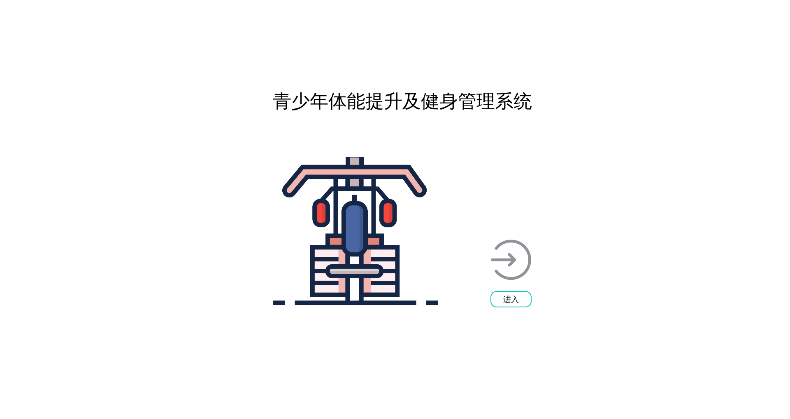

# 青少年体质提升及健身管理系统

## 项目名称

青少年体质提升及健身管理系统

## 开发计划

[开发计划](./Fitness-Equipment/planning.md)

## 软件及开发环境

1. OS: Raspbian GNU/Linux 11 (bullseye) aarch64
2. 编译器: gcc clang
3. ui框架: qt5
4. 开发工具: VSCode
5. 开发语言: cpp

## 硬件设备

- 主控核心: 树莓派4B
- 动力设备: [Unitree A1 电机](./development%20resource/A1电机资料/01电机手册及文档/)
- 监测设备: [皮肤电手环](https://sichiray-tech.yuque.com/dm0eyv/chanpin/tisx58x4wb8fuu75)

## 开发日志

[开发日志](./develop-log.txt),该开发日志使用git直接导出

## 开发任务

1. 安全健身，在健身时根据手环imu数据，判断是否存在手臂抖动的情况，停止健身。
2. 体质检测，UI显示各项指标，根据运动时的心率数据，血氧数据，皮肤电数据，电机力矩数据，和运动次数判断个人体质。
3. 个人体质提升健身规划，根据检测的个人体质，合理规划健身计划

## 实现方案

### 安全健身的实现

参考FIR滤波器的实现思路，对imu数据进行滤波或者说对历史n次信号取平均，然后将实际值减同相位值，获取高频分量，根据判断高频分量出现的实现，判断是否发生危险事件

### 个人体质提升健身规划的实现

对单次运动进行计算打分，根据分数分配下次健身任务。
